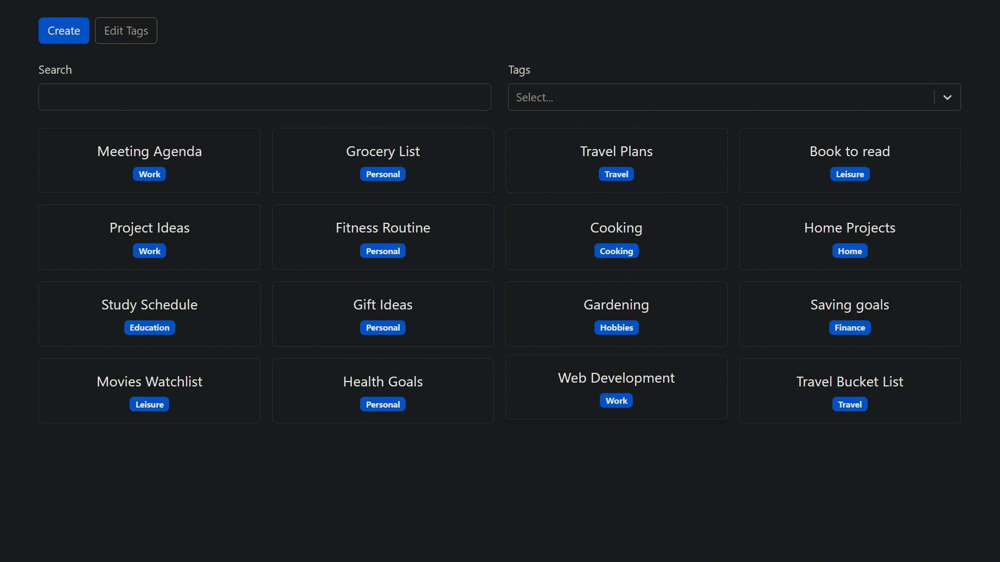

<div align="center">
    <a href="https://notes-fv.netlify.app" target="_blank">
      
    </a>
  <h3 align="center">Notes App - React / TypeScript</h3>
</div>

##  <br /> 📋 <a name="table">Table of Contents</a>

- ✨ [Introduction](#introduction)
- ⚙️ [Tech Stack](#tech-stack)
- 📝 [Features](#features)
- 🚀 [Quick Start](#quick-start)

##  <br /> <a name="introduction">✨ Introduction</a>

**[EN]** Note-taking application built using React and TypeScript, enhancing traditional to-do lists with advanced features. This project covers all aspects of CRUD (Create, Read, Update, Delete) operations, allowing users to create new notes, view existing ones, update content, and delete notes as needed. It includes additional features like categories and markdown support, making it an ideal intermediate project for exploring React concepts.

**[FR]** Application de prise de notes construite avec React et TypeScript, enrichissant les listes de tâches traditionnelles avec des fonctionnalités avancées. Ce projet couvre tous les aspects des opérations CRUD (Create, Read, Update, Delete), permettant aux utilisateurs de créer de nouvelles notes, consulter les existantes, mettre à jour le contenu et supprimer des notes au besoin. Il inclut des fonctionnalités supplémentaires telles que les catégories et le support Markdown, en faisant un projet intermédiaire idéal pour explorer les concepts de React.


##  <br /> <a name="tech-stack">⚙️ Tech Stack</a>

- **React** is a popular JavaScript library for building user interfaces, particularly single-page applications where data changes over time. React's component-based architecture allows developers to create reusable UI components, making development more efficient and the codebase easier to maintain. 

- **TypeScript** is a statically typed superset of JavaScript that allows for early detection of errors and more robust, maintainable code. TypeScript's type system helps developers catch mistakes early during the development process, ensuring a more stable and reliable application.

- **Bootstrap** is a front-end framework celebrated for its extensive suite of pre-styled components and responsive grid system. It simplifies the development of mobile-first websites and applications, offering developers flexibility and cross-browser compatibility.

- **Vite** is a modern frontend build tool known for fast ES Module imports, efficient bundling, and quick development server startup times. It supports frameworks like Vue.js and React, optimizing workflow and performance compared to traditional bundlers.

- **Markdown** is a lightweight markup language that simplifies formatting plain text into structured content. Widely used for writing documentation, README files, and blog posts, Markdown offers a straightforward syntax for styling text with headers, lists, links, and more. Its simplicity and compatibility across various platforms make it a preferred choice for creating well-formatted content with ease.

- **UUID** (Universally Unique Identifier) is a standard for generating unique identifiers in software development. These identifiers are highly unlikely to be duplicated across different systems, ensuring uniqueness. Represented as a 36-character hexadecimal string, UUIDs are crucial for maintaining data integrity in distributed databases, session management, and messaging systems without requiring centralized coordination.


## <br/> <a name="features">📝 Features</a>

👉 **Markdown Support**: Integrates Markdown for formatting notes with headers, lists, links, and more.

👉 **UUID Generation**: Utilizes UUID for generating unique identifiers for each note entry.

👉 **Categories**: Organizes notes into customizable categories for efficient management.

👉 **Filters**: Implements filters to easily sort and retrieve notes based on categories or tags.

👉 **Responsive Design**: Ensures the application is fully functional and optimized for various devices and screen sizes.

👉 **CRUD Operations**: Provides Create, Read, Update, and Delete functionalities for managing notes seamlessly.

👉 **Search Functionality**: Enables users to search for specific notes by title, content, or tags.


## <br /> <a name="quick-start">🚀 Quick Start</a>

Follow these steps to set up the project locally on your machine.

<br/>**Prerequisites**

Make sure you have the following installed on your machine:

- [Git](https://git-scm.com/)
- [Node.js](https://nodejs.org/en)
- [npm](https://www.npmjs.com/) (Node Package Manager)

<br/>**Cloning the Repository**

```bash
git clone {git remote URL}
```

<br/>**Installation**

Let's install the project dependencies, from your terminal, run:

```bash
npm install
# or
yarn install
```

<br/>**Running the Project**

Installation will take a minute or two, but once that's done, you should be able to run the following command:

```bash
npm run dev
# or
yarn dev
```

Open [`http://localhost:5173`](http://localhost:5173) in your browser to view the project.